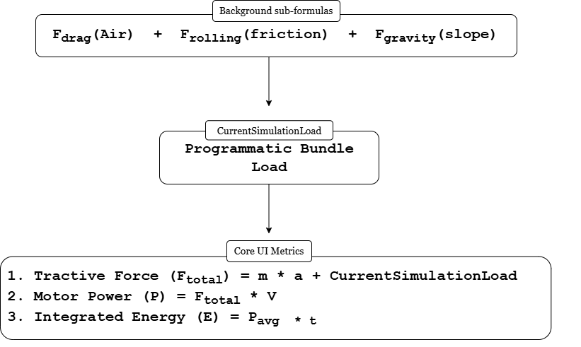

# Experiment Theory: AI-Based Eco-Driving and Energy Optimization

## 1. Objective
To analyze electric vehicle (EV) tractive forces and environmental resistances (aerodynamic drag, rolling friction, and gravitational grade resistance) under varying velocities and terrain profiles. The experiment dynamically simulates live battery telemetry, cell temperature heatmaps, and continuous energy integration to optimize driving range, eco-scores, and thermal strain under realistic operating conditions.

---

## 2. Basic Terminologies

*   **Tractive Force ($F_{\text{total}}$ / $F_{\text{req}}$):** The absolute net force vector required to propel the electric vehicle onward against combined external air, ground, and slope resistances, plus any instantaneous acceleration force requirements.
*   **Aerodynamic Drag ($F_{\text{drag}}$):** The resistive force acting opposite to the vehicle's vector of travel caused by atmospheric air molecules displacing across the frontal area surface layout.
*   **Rolling Friction ($F_{\text{rolling}}$):** The continuous mechanical force resisting tire rotation over the roadbed pavement, driven by minor mechanical wheel deformation during motion cycles.
*   **Gravitational Grade Resistance ($F_{\text{gravity}}$):** The structural weight vector pulling down along an inclined or declined grade, acting either as an opposing load during climbs or a driving force during descents.
*   **Baseline Environmental Load ($currentSimulationLoad$):** The background mathematical bundling of all static external physical resistances ($F_{\text{drag}} + F_{\text{rolling}} + F_{\text{gravity}}$) acting on the vehicle chassis at any given velocity and incline state.
*   **Dynamic Telemetry Integration:** The continuous summation of real-time power metrics over a fixed test period ($\Delta t = 0.025\text{s}$) to map cumulative energy consumption ($E = \int P \, dt$) against dynamic driving profile behaviors and shifting payloads.
*   **State of Charge (SoC):** The remaining usable energy capacity of the battery pack expressed as a percentage, acting as the primary telemetry health metric for range estimation.
*   **Regenerative Braking Capture:** The process by which the electric motor reverses torque direction during deceleration or downhill descents, capturing kinetic energy to recharge the battery pack instead of dissipating it as friction heat.

---

## 3. Pre-Requisite Concepts

### A. Tractive Power Mechanics & Powertrain Loading
An electric vehicle powertrain operates by translating electrical energy stored in chemical battery cells into rotational mechanical torque at the wheels. To maintain a constant target speed or execute acceleration, the motor torque must match or exceed the cumulative physical resistance vectors presented by the ambient environment. If physical loads are modeled statically, real-world range tracking fails due to changing road topologies and velocity profiles.

### B. Kinematic Profiles and Transient States
Driving behavior is rarely uniform. Vehicles switch between three major states: *Acceleration* (where motor torque must overcome both structural inertia and environmental drag), *Cruising* (where torque balances drag and friction at a steady velocity), and *Deceleration/Braking* (where kinetic energy is either lost to friction or recovered through regeneration). Accurate telemetry requires evaluating these transient states continuously over time rather than modeling single static snapshots.

### C. Battery Degradation and Thermal Sag Metrics
Drawing large amounts of current from a chemical lithium-ion battery pack generates heat due to internal resistance ($I^2R$ losses). High cell temperatures alter internal efficiency, create terminal voltage sag, and increase thermal strain. Conversely, during regenerative braking, high current is forced back into the cells. Telemetry tracking ensures that these values remain within stable thermal boundaries to preserve pack longevity.

---

## 4. Mathematical Modeling & Simulation Formulas

The simulation dashboard translates complex physical states into clean UI readouts. Under the hood, a hierarchy of background sub-formulas continuously executes to compute the primary values displayed on the interface.

### A. Background Sub-Formulas (Environmental Resistances)
These three equations run silently in the background of the execution loop every $0.025\text{s}$ to construct the ambient environmental profile.

#### 1. Aerodynamic Drag Force
$$F_{\text{drag}} = 0.5 \times \rho \times C_d \times A \times v^2$$
*   **Definition:** The fluid resistance force encountered by the vehicle body moving through ambient atmosphere.
*   **Parameters:** $\rho$ = Air Density ($1.225\text{ kg/m}^3$), $C_d$ = Drag Coefficient ($0.24$), $A$ = Frontal Area ($2.2\text{ m}^2$), $v$ = Velocity (m/s).
*   **Application:** Modeled in the backend to capture the exponential load penalty that occurs at high velocities, directly draining vehicle range.

#### 2. Rolling Friction Resistance
$$F_{\text{rolling}} = \mu \times m \times g \times \cos(\theta)$$
*   **Definition:** The force opposing mechanical tire tread rotation caused by tire deformation against the road surface mesh.
*   **Parameters:** $\mu$ = Friction Coefficient ($0.012$), $m$ = Total System Mass (kg), $g$ = Gravity ($9.81\text{ m/s}^2$), $\theta$ = Incline Angle (rad).
*   **Application:** Calculated continuously to factor in pavement friction variations and how normal force alters across shifting slopes.

#### 3. Gravitational Grade Resistance
$$F_{\text{gravity}} = m \times g \times \sin(\theta)$$
*   **Definition:** The component of the vehicle's structural weight vector acting parallel to the road slope surface.
*   **Parameters:** $m$ = Total Simulation Weight (kg), $g$ = Gravity ($9.81\text{ m/s}^2$), $\theta$ = Incline Angle (rad).
*   **Application:** Injected into the script loop to add massive physical resistance during steep climbs ($+12^\circ$) or to drive the car forward as a negative resistance during downhill descents ($-10^\circ$).

---

### B. Core UI Formulas (Programmatic Bundling)
The sub-formulas above flow directly into the primary mathematical metrics driving the user interface readouts.

#### 1. Live Tractive Force UI Display
$$F_{\text{total}} = (m \times a) + currentSimulationLoad$$
Where:
$$currentSimulationLoad = F_{\text{gravity}} + F_{\text{rolling}} + F_{\text{drag}}$$
*   **Definition:** The absolute force required by the powertrain to move the car through the environment at a specific acceleration state ($a$).
*   **UI Target:** Displayed as **Tractive Force ($F_{\text{total}}$)** under *Live Calculations* and *Baseline Load* on the HUD box.
*   **Application:** It bridges fundamental laws of motion with programmatic tracking. By gathering the background forces into `currentSimulationLoad`, the script easily calculates transient requirements during stop-and-go cycles.

#### 2. Live Motor Power Draw UI Display
$$P_{\text{motor}} = \frac{F_{\text{total}} \times v}{1000}$$
*   **Definition:** The mechanical rate of energy deployment by the EV motor converted into kilowatts (kW).
*   **UI Target:** Displayed as **Motor Power ($P_{\text{motor}}$)** on the dashboard.
*   **Application:** Maps how changes in environmental loads or driver acceleration impact real-time powertrain power draw. When traveling downhill, negative values are generated, indicating that the motor has switched into a generator for regenerative energy capture.

#### 3. Integrated Cumulative Energy Display
$$E = P_{\text{avg}} \times t$$
*   **Definition:** The total electrical energy transferred out of or into the battery pack over a given period, calculated programmatically as:
$$\Delta E = \frac{P_{\text{electrical}} \times \Delta t}{3600}$$
*   **UI Target:** Displayed inside the *Live Energy & Power Integration* sub-panel.
*   **Application:** Continuously tracks battery depletion. In downhill descents, a net negative energy consumed is logged, proving to the user that regenerative braking is actively putting charge back into the pack rather than consuming it.
